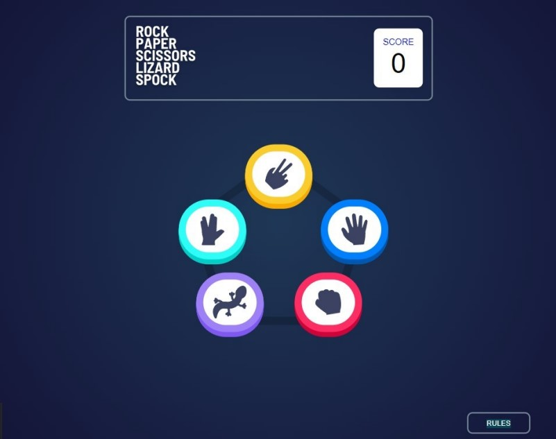

# ⚠️ Antes de comenzar ⚠️
Importante aclarar que no es una página web real, es un proyecto creado para el módulo de Desarrollo web en entorno cliente y Diseño de interfaces web de segundo de ciclo de Desarrollo de aplicaciones web (idea sacada de la web Frontend Mentor).

# Piedra, papel, tijera, lagarto, spock
Este proyecto va sobre el juego piedra, papel, tijera, lagarto, spock. (Conocido por la serie The big bang theory).

# 📸 Página principal

# 👤Uso de la aplicación
Al ser un juego sencillo y no necesitar iniciar sesión ni nada, cualquiera puede acceder a jugar.

1. Si no sabe como se juega, al darle al botón de rules se mostrarán las reglas y lo que hace cada opción de juego.
2. Para empezar el juego, en la página principal hay colocado un pentagono en el cuál en cada esquina hay una jugada (la piedra, el papel, la tijera, el lagarto y spock), el jugador tiene que seleccionar una de esas opciones.
3. Tras seleccionar una de las opciones, se mostrar la opción elegida y el programa mostrará de manera aleatoria otra opción.
4. Cuando el programa muestre su opción el programa mostrarrá quién gana y quién pierde junto a un botón que pone 'play again' que dandole se vuelve a la pantalla donde se muestran las opciones de juego.
5. El contador sumara + 1 cada vez que gane, el juego acaba cuando el jugador pierde ya que el contador se pondrá a 0 y podrá volver a comenzar el juego.

# Reglas del juego
* Tijeras cortan papel.
* Papel tapa a piedra.
* Piedra aplasta a lagarto.
* Lagarto evenena a Spock.
* Spock rompe tijeras.
* Tijeras decapitan lagarto.
* Lagarto devora papel.
* Papel desautoriza Spock.
* Spock vaporiza piedra.
* Piedra aplasta a tijeras.

# 🪛Tecnologías
Para llevar a cabo la realización de este proyecto, he utilizado:
* HTML
* CSS
* JavaScript
* Github

# 👩🏻‍💻Autora
* Sara Marrero Miranda
